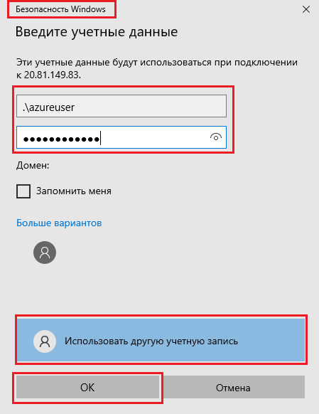

---
wts:
    title: '01 — создание виртуальной машины на портале (10 мин)'
    module: 'Модуль 02. Основные службы Azure (рабочие нагрузки)'
---
# 01 — создание виртуальной машины на портале

В этом пошаговом руководстве мы создадим виртуальную машину на портале Azure, подключимся к ней, установим роль веб-сервера и проведем тестирование. 

**Примечание**. Во время работы с этим пошаговым руководством уделите время на ознакомление со сведениями, отображаемыми при щелчке информационных значков. 

# Задача 1. Создание виртуальной машины (10 мин)

В рамках этой задачи мы создадим виртуальную машину Windows Server 2019 Datacenter 1-го поколения. 

1. Войдите на [портал Azure (https://portal.azure.com)](https://portal.azure.com?azure-portal=true).

2. В колонке **Все службы** найдите и выберите элемент **Виртуальные машины**, а затем щелкните **+ Добавить** и выберите **+Виртуальная машина**.

3. На вкладке **Основные** укажите следующие сведения (для остальных параметров оставьте значения по умолчанию):

    | Параметры | Значения |
    |  -- | -- |
    | Подписка | **Выберите свою подписку**|
    | Группа ресурсов | **myRGVM** (создайте новую) |
    | Имя виртуальной машины | **myVm** |
    | Расположение | **(США) Восточная часть США**|
    | Образ | **Windows Server 2019 Datacenter 1-го поколения**|
    | Размер | Standard D2s v3|
    | Имя пользователя учетной записи администратора | **azureuser** |
    | Пароль учетной записи администратора | **Pa$$w0rd1234**|
    | "Правила входящего порта" — "Разрешить выбранные порты" | **RDP (3389)** и **HTTP (80)**|
    | | |

4. Перейдите на вкладку "Сеть" и найдите параметр **Выбрать входящие порты**:

    | Параметры | Значения |
    | -- | -- |
    | Выбрать входящие порты | **HTTP (80), RDP (3389)**|
    | | |

    **Примечание.** Убедитесь, что выбраны оба порта — 80 и 3389.

5. Перейдите на вкладку "Управление" и в разделе **Мониторинг** выберите следующий параметр:

    | Параметры | Значения |
    | -- | -- |
    | Диагностика загрузки | **Отключить**|
    | | |

6. Для остальных параметров оставьте значения по умолчанию и нажмите кнопку **Просмотр и создание** в нижней части страницы.

7. После прохождения проверки нажмите кнопку **Создать**. Развертывание виртуальной машины может занять от пяти до семи минут.

8. Вы будете получать сведения о ходе выполнения на странице развертывания и в области **Уведомления** (значок колокольчика в верхнем меню).

* **Убедитесь, что порты 80 и 3389 открыты.**

# Задача 2. Подключение к виртуальной машине

В рамках этой задачи мы подключимся к новой виртуальной машине по протоколу удаленного рабочего стола (RDP). 

1. Выполните поиск по имени **myVM** и выберите свою новую виртуальную машину.

    **Примечание**. Вы также можете воспользоваться ссылкой **Перейти к ресурсу** на странице развертывания или ссылкой на ресурс в области **Уведомления**.

2. В колонке **Обзор** виртуальной машины нажмите кнопку **Подключить** и выберите **RDP**.

    

    **Примечание**. Приведенные ниже указания помогут вам подключиться к виртуальной машине с компьютера под управлением Windows. На Mac вам потребуется клиент RDP, например Remote Desktop Client из Mac App Store, а на компьютере с Linux можно использовать клиент RDP с открытым кодом.

2. На странице **Подключение к виртуальной машине** оставьте параметры по умолчанию для подключения к общедоступному IP-адресу через порт 3389 и щелкните элемент **Скачать RDP-файл**.

3. Выберите **Открыть**, чтобы открыть скачанный файл RDP, и **Подключить** при появлении соответствующего запроса. 

    

4. В окне **Безопасность Windows** выберите **Больше вариантов**, а затем **Использовать другую учетную запись**. Укажите имя пользователя (.\azureuser) и пароль (Pa$$w0rd1234). Нажмите кнопку **ОК** для подключения.

    

5. Во время входа в систему может появиться предупреждение о сертификате. Нажмите кнопку **Да**, чтобы создать подключение и подключиться к развернутой виртуальной машине. Подключение должно пройти успешно.

    

Поздравляем! Вы развернули виртуальную машину Windows Server и подключились к ней в Azure.

# Задача 3. Установка роли веб-сервера и тестирование

В рамках этой задачи вы установите на сервере роль веб-сервера и убедитесь, что стандартная страница приветствия IIS отображается.

1. Откройте на виртуальной машине командную строку PowerShell, нажав кнопку **Пуск**, введя **PowerShell**, щелкнув правой кнопкой мыши элемент **Windows PowerShell** и выбрав в появившемся меню пункт **Запуск от имени администратора**.

    

2. Установите компонент **Веб-сервер** на виртуальной машине, выполнив следующую команду в командной строке PowerShell. Вы можете скопировать и вставить эту команду.

    ```PowerShell
    Install-WindowsFeature -name Web-Server -IncludeManagementTools
    ```
  
3. После завершения выполнения появится командная строка с элементом **Успешно**, для которого указано значение **True**. Перезапускать виртуальную машину для завершения установки не требуется. Закройте подключение RDP к виртуальной машине.

    

4. Вернитесь на портал, перейдите обратно в колонку **Обзор** виртуальной машины myVM, нажмите кнопку **Копировать в буфер обмена**, чтобы скопировать общедоступный IP-адрес виртуальной машины myVM, откройте новую вкладку в браузере, вставьте этот адрес в текстовое поле URL-адреса и нажмите клавишу **Ввод** для перехода.

    

5. Откроется страница приветствия веб-сервера IIS.

    

Поздравляем! Вы создали веб-сервер, к которому можно обратиться по общедоступному IP-адресу. Если у вас есть веб-приложение для размещения, можно развернуть его файлы на виртуальной машине и разместить их для общего доступа на развернутой виртуальной машине.


**Примечание**. Эту группу ресурсов можно удалить во избежание дополнительных затрат. Выполните поиск по группам ресурсов, выберите свою группу и щелкните **Удалить группу ресурсов**. Проверьте имя группы ресурсов и выберите **Удалить**. Следите за областью **Уведомления**, чтобы убедиться, что удаление прошло успешно. 
