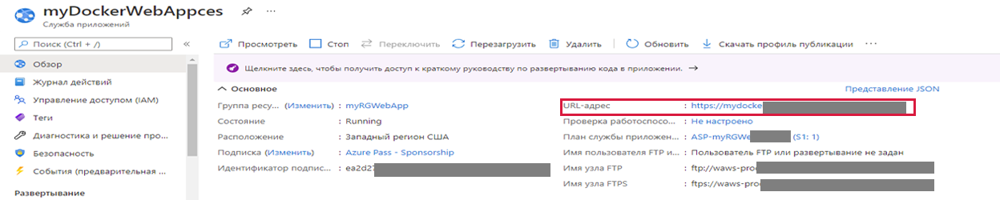

---
wts:
    title: '02 — создание веб-приложения (10 мин)'
    module: 'Модуль 02. Основные службы Azure (рабочие нагрузки)'
---
# 02 — создание веб-приложения

В этом пошаговом руководстве мы создадим веб-приложение, выполняющее контейнер Docker. Этот контейнер отображает приветственное сообщение. 

# Задача 1. Создание веб-приложения (10 мин)

Служба приложений Azure фактически представляет собой набор из четырех служб, каждая из которых упрощает размещение и выполнение веб-приложений. Эти четыре службы (веб-приложения, мобильные приложения, приложения API и Logic Apps) выглядят по-разному, однако в работе довольно похожи друг на друга. Служба веб-приложений используется чаще остальных, и именно ею мы воспользуемся в этом задании.

В рамках этой задачи вы создадите веб-приложение службы приложений Azure. 

1. Войдите на [портал Azure](http://portal.azure.com/). 

2. В колонке **Все службы** найдите и выберите элемент **Службы приложений**, а затем щелкните **+ Добавить, + Создать или + Новый**.

3. На вкладке **Основные** колонки **Веб-приложение** укажите следующие параметры (замените **xxxx** в имени веб-приложения буквами и цифрами, чтобы имя было глобально уникальным). Для остальных параметров, включая "План службы приложений", оставьте значения по умолчанию. 

    | Параметр | Значение |
    | -- | -- |
    | Подписка | **Выберите свою подписку** |
    | Группа ресурсов | **myRGWebApp1** (создайте новую) |
    | Имя | **myDockerWebAppxxxx** |
    | Публикация | **Контейнер Docker** |
    | Операционная система | **Linux** |
    | Регион | **Восточная часть США** (игнорируйте все предупреждения о доступности плана обслуживания) |
    | | |	
    
    **Примечание.** Не забудьте заменить символы **xxxx**, чтобы **Имя** стало уникальным.

4. Щелкните **Далее > Docker** и настройте сведения о контейнере. Команда запуска является необязательной и не требуется в данном упражнении. 

    **Примечание.** Это тот же самый контейнер, который использовался в пошаговом руководстве "Экземпляры контейнеров" для отображения сообщения Hello World. 

    | Параметр | Значение |
    | -- | -- |
    | Параметры | **Один контейнер** |
    | Источник образа | **Docker Hub** |
    | Тип доступа | **Общедоступный** |
    | Образ и тег | **microsoft/aci-helloworld** |
    | | |	

5. Нажмите кнопку **Просмотр и создание**, а затем кнопку **Создать**. 

# Задача 2. Тестирование веб-приложения

В рамках этой задачи вы протестируете веб-приложение.

1. Дождитесь развертывания веб-приложения.

2. В области **Уведомления** щелкните **Перейти к ресурсу**. 

3. В колонке **Обзор** найдите запись **URL-адрес**. 

    

4. Щелкните **URL-адрес**, чтобы открыть новую вкладку браузера и отобразить страницу приветствия экземпляров контейнеров Azure.

    

5. Перейдите обратно на вкладку **Обзор** своего веб-приложения и обратите внимание, что на ней присутствует несколько диаграмм. Если несколько раз повторить шаг 4, вы увидите, как на диаграммах отображаются соответствующие данные телеметрии, включая число запросов и среднее время ответа. 

**Примечание**. Эту группу ресурсов можно удалить во избежание дополнительных затрат. Выполните поиск по группам ресурсов, выберите свою группу и щелкните **Удалить группу ресурсов**. Проверьте имя группы ресурсов и выберите **Удалить**. Следите за областью **Уведомления** для отслеживания процесса удаления.

