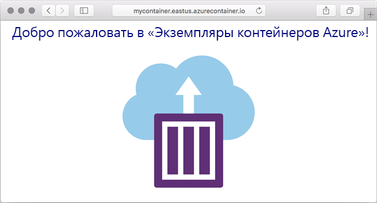

---
wts:
    title: '03 — развертывание экземпляров контейнеров Azure (10 мин)'
    module: 'Модуль 02. Основные службы Azure (рабочие нагрузки)'
---

# 03 — развертывание экземпляров контейнеров Azure

В этом пошаговом руководстве мы создадим, настроим и развернем контейнер Docker, используя службу «Экземпляры контейнеров Azure» (ACI) на портале Azure. Этот контейнер представляет собой веб-приложение, отображающее статическую HTML-страницу с приветствием экземпляров контейнеров Azure. 

# Задача 1. Создание экземпляра контейнера (10 мин)

В рамках этой задачи мы создадим экземпляр контейнера для веб-приложения. 

1. Войдите на [портал Azure](https://portal.azure.com).

2. В колонке **Все службы** найдите и выберите элемент **Экземпляры контейнеров**, а затем щелкните **+ Добавить, + Создать или + Новый**. 

3. Укажите следующие основные сведения для нового экземпляра контейнера (для остальных параметров оставьте значения по умолчанию): 

	| Параметр| Значение|
	|----|----|
	| Подписка | **Выберите свою подписку** |
	| Группа ресурсов | **myRGContainer** (создайте новую) |
	| Имя контейнера| **mycontainer**|
	| Регион | **(США) Восточная часть США** |
	| Источник образа| **Docker Hub или другой реестр**|
	| Тип образа| **Общедоступный**|
	| Образ| **microsoft/aci-helloworld**|
	| Тип ОС| **Linux** |
	| Размер| ***Оставьте значение по умолчанию***|
	|||

4. Настройте параметры на вкладке "Сеть" (замените символы **xxxx** буквами и цифрами так, чтобы имя было глобально уникальным). Для остальных параметров оставьте значения по умолчанию.

	| Параметр| Значение|
	|--|--|
	| Метка DNS-имени| **mycontainerdnsxxxx** |
	|||
	
	**Примечание**. Ваш контейнер будет находиться в общем доступе по адресу метка-dns-имени.регион.azurecontainer.io. Если после развертывания вы получаете сообщение об ошибке **Метка DNS-имени недоступна**, укажите другую метку DNS-имени (не используйте xxxx) и повторите развертывание. 

	

5. Щелкните **Проверить и создать**, чтобы запустить процесс автоматической проверки.

6. Нажмите кнопку **Создать**, чтобы создать экземпляр контейнера. 

7. Отслеживайте ход выполнения на странице развертывания и странице **Уведомления**. 

8. Во время ожидания вы можете просмотреть [пример кода для этого простого приложения](https://github.com/Azure-Samples/aci-helloworld). Перейдите в папку \app. 

# Задача 2. Проверка развертывания экземпляра контейнера

В рамках этой задачи мы подтвердим, что экземпляр контейнера выполняется, проверив отображение страницы приветствия.

1. После завершения развертывания щелкните ссылку **Перейти к ресурсу** на странице развертывания или ссылку на ресурс в области "Уведомления".

2. В колонке **Обзор** контейнера **mycontainer** убедитесь, что **Состояние** контейнера имеет значение **Выполняется**. 

3. Найдите полное доменное имя (FQDN).

	

2. Скопируйте FQDN контейнера в текстовое поле URL-адреса в веб-браузере и нажмите клавишу **ВВОД**. Должна появиться страница приветствия. 

	

**Примечание**. В браузере также можно указать IP-адрес контейнера. 

Поздравляем! Вы использовали портал Azure для развертывания приложения в контейнере в Экземплярах контейнеров Azure.

**Примечание**. Эту группу ресурсов можно удалить во избежание дополнительных затрат. Выполните поиск по группам ресурсов, выберите свою группу и щелкните **Удалить группу ресурсов**. Проверьте имя группы ресурсов и выберите **Удалить**. Следите за областью **Уведомления** для отслеживания процесса удаления.
