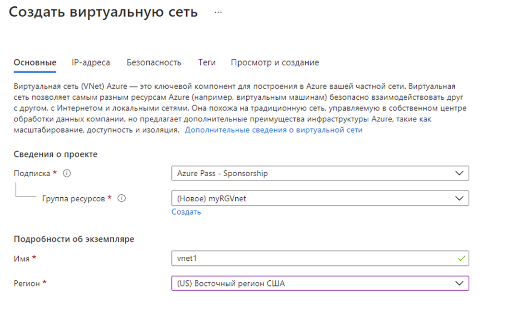

---
wts:
    title: '04 — создание виртуальной сети (20 мин)'
    module: 'Модуль 02. Основные службы Azure (рабочие нагрузки)'
---
# 04 — создание виртуальной сети

В этом пошаговом руководстве мы создадим виртуальную сеть, развернем в ней две виртуальные машины и затем разрешим одной из виртуальных машин проверить связь с другой внутри этой виртуальной сети.

# Задача 1. Создание виртуальной сети (20 мин)

В рамках этой задачи мы создадим виртуальную сеть. 

1. Войдите на портал Azure по адресу <a href="https://portal.azure.com" target="_blank"><span style="color: #0066cc;" color="#0066cc">https://portal.azure.com</span></a>

2. В колонке **Все службы** найдите и выберите элемент **Виртуальные сети**, а затем щелкните **+ Добавить, + Создать или + Новый**. 

3. В колонке **Создание виртуальной сети** укажите следующие сведения (для остальных параметров оставьте значения по умолчанию):

    | Параметр | Значение | 
    | --- | --- |
    | Подписка | **Выберите свою подписку** |
    | Группа ресурсов | **myRGVNet** (создайте новую) |
    | Имя | **классы vnet1** |
    | Расположение | **(США) Восточная часть США** |
    | Адресное пространство |**10.1.0.0/16** |
    | Подсеть — имя | **значение по умолчанию** |
    | Диапазон адресов подсети | **10.1.0.0/24** |

    
    

5. Нажмите кнопку **Проверка и создание**. Убедитесь, что проверка выполняется успешно.

6. Нажмите кнопку **Создать**, чтобы развернуть виртуальную сеть. 

    **Примечание**. Как вы можете узнать, какие виртуальные сети и IP-адреса понадобятся вашей организации?

# Задача 2. Создание двух виртуальных машин

В рамках этой задачи мы создадим в виртуальной сети две виртуальных машины. 

1. В колонке **Все службы** найдите и выберите элемент **Виртуальные машины**, а затем щелкните **+ Добавить** и выберите **+ Виртуальная машина**. 

2. На вкладке **Основные** укажите следующие сведения (для остальных параметров оставьте значения по умолчанию):

   | Параметр | Значение | 
   | --- | --- |
   | Подписка | **Выберите свою подписку**  |
   | Группа ресурсов |  **myRGVNet** |
   | Имя виртуальной машины | **vm1**|
   | Регион | **(США) Восточная часть США** |
   | Образ | **Windows Server 2019 Datacenter** |
   | Имя пользователя| **azureuser** |
   | Пароль| **Pa$$w0rd1234** |
   | Общедоступные входящие порты| Выберите **Разрешить выбранные порты**.  |
   | Выбранные входящие порты| **RDP (3389)** |
   |||

3. Перейдите на вкладку **Сеть**. Убедитесь, что виртуальная машина находится в виртуальной сети vnet1. Просмотрите параметры по умолчанию, но не вносите никакие другие изменения. 

   | Параметр | Значение | 
   | --- | --- |
   | Виртуальная сеть | **vnet1** |
   |||

4. Щелкните **Просмотр и создание**. После выполнения проверки щелкните **Создать**. Время развертывания может различаться, однако обычно оно составляет от трех до шести минут.

5. Следя за развертыванием, перейдите к следующему шагу. 

6. Создайте вторую виртуальную машину, повторив шаги **с 2 по 4**, приведенные выше. Убедитесь, что для виртуальной машины используется другое имя, а сама виртуальная машина находится в той же виртуальной сети и использует новый общедоступный IP-адрес:

    | Параметр | Значение |
    | --- | --- |
    | Группа ресурсов | **myRGVNet** |
    | Имя виртуальной машины |  **классы vm2** |
    | Виртуальная сеть | **vnet1** |
    | Общедоступный IP-адрес | (новый) **vm2-ip** |
    |||

7. Дождитесь развертывания обеих виртуальных машин. 

# Задача 3. Тестирование подключения 

В рамках этой задачи мы выполним вход в одну виртуальную машину и проверку связи с другой виртуальной машиной. 

1. В колонке **Все ресурсы** найдите виртуальную машину **vm1**, откройте ее колонку **Обзор** и убедитесь, что параметр **Состояние** имеет значение **Выполняется**. Возможно, вам потребуется **Обновить** страницу.

2. В колонке **Обзор** нажмите кнопку **Подключить**.

    **Примечание**. Приведенные ниже указания помогут вам подключиться к виртуальной машине с компьютера под управлением Windows. 

3. В колонке **Подключение к виртуальной машине** оставьте параметры по умолчанию для подключения по IP-адресу через порт 3389 и щелкните элемент **Скачать RDP-файл**.

4. Откройте скачанный файл RDP и нажмите кнопку **Подключить** при появлении соответствующего запроса. 

5. В окне **Безопасность Windows** введите имя пользователя **azureuser** и пароль **Pa$$w0rd1234**, а затем нажмите кнопку **ОК**.

6. Во время входа в систему может появиться предупреждение о сертификате. Нажмите кнопку **Да**, чтобы создать подключение и подключиться к развернутой виртуальной машине. Подключение должно пройти успешно.

7. Откройте на виртуальной машине командную строку PowerShell, нажав кнопку **Пуск**, введя **PowerShell**, щелкнув правой кнопкой мыши элемент **Windows PowerShell** и выбрав пункт **Запуск от имени администратора**.

8. В Powershell введите следующую команду, чтобы попытаться связаться с виртуальной машиной vm2. Операция будет выполнена успешно.

   ```PowerShell
   ping vm2
   ```

Поздравляем! Вы настроили и развернули две виртуальных машины в виртуальной сети. Вы также проверили связь между этими виртуальными машинами. 

**Примечание**. Эту группу ресурсов можно удалить во избежание дополнительных затрат. Выполните поиск по группам ресурсов, выберите свою группу и щелкните **Удалить группу ресурсов**. Проверьте имя группы ресурсов и выберите **Удалить**. Следите за областью **Уведомления** для отслеживания процесса удаления.
