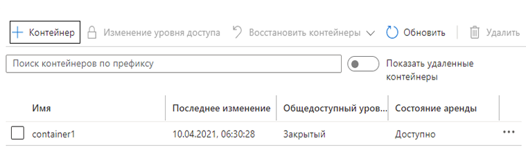

---
wts:
    title: '05 — создание хранилища BLOB-объектов (5 мин)'
    module: 'Модуль 02. Основные службы Azure (рабочие нагрузки)'
---
# 05 — создание хранилища BLOB-объектов

В этом пошаговом руководстве мы создадим учетную запись хранения, а затем будем работать с файлами хранилища BLOB-объектов.

# Задача 1. Создание учетной записи хранения (5 мин)

В рамках этой задачи мы создадим учетную запись хранения. 

1. Войдите на портал Azure по адресу <a href="https://portal.azure.com" target="_blank">https://portal.azure.com</a>

2. В колонке **Все службы** найдите и выберите элемент **Учетные записи хранения**, а затем щелкните **+ Добавить, + Создать или + Новый**. 

3. На вкладке **Основные** в колонке **Создание учетной записи хранения** укажите следующие сведения (замените **xxxx** в имени учетной записи хранения буквами и цифрами, чтобы имя было глобально уникальным). Для остальных параметров оставьте значения по умолчанию.

    | Параметр | Значение | 
    | --- | --- |
    | Подписка | **Выберите свою подписку** |
    | Группа ресурсов | **myRGStorage** (создайте новую) |
    | Имя учетной записи хранения | **storageaccountxxxx** |
    | Расположение | **(США) Восточная часть США**  |
    | Производительность | **Стандартный** |
    | Тип учетной записи | **StorageV2 (учетная запись общего назначения версии 2)** |
    | Репликация | **Локально избыточное хранилище (LRS)** |
    | | |

    **Примечание.** -  Не забудьте заменить символы **xxxx**, чтобы **Имя учетной записи хранения** стало уникальным.

5. Щелкните **Просмотр и создание**, чтобы просмотреть параметры учетной записи хранения и разрешить Azure проверить конфигурацию. 

6. После проверки нажмите кнопку **Создать**. Дождитесь уведомления об успешном создании учетной записи. 

7. На домашней странице найдите и выберите элемент **Учетные записи хранения** и убедитесь, что ваша новая учетная запись хранения присутствует в списке.

    

# Задача 2. Работа с хранилищем BLOB-объектов

В рамках этой задачи мы создадим контейнер BLOB-объектов и отправим файл BLOB-объектов. 

1. Щелкните имя новой учетной записи хранения, перейдите к разделу **Служба BLOB-объектов** и щелкните **Контейнеры**.

2. Щелкните **+ Контейнер** и укажите информацию. Используйте значки информации для получения дополнительных сведений. Когда закончите, нажмите кнопку **Создать**.

    | Параметр | Значение |
    | --- | --- |
    | Имя | **container1**  |
    | Общедоступный уровень доступа| **Частный (без анонимного доступа)** |
    | | |

    

4. Щелкните контейнер **container1** и затем **Отправить**.

5. Перейдите к файлу на локальном компьютере. 

    **Примечание**. Вы можете создать пустой файл `TXT` или использовать любой существующий файл. Рекомендуется выбрать файл небольшого размера, чтобы минимизировать время отправки.

6. Щелкните стрелку **Дополнительно**, оставьте значения по умолчанию, но просмотрите доступные параметры, а затем щелкните **Отправить**.

    **Примечание**. Таким способом вы можете отправить любое число BLOB-объектов. Новые BLOB-объекты будут перечислены в контейнере.

7. После отправки файла щелкните его правой кнопкой мыши и обратите внимание на параметры, включая "Просмотреть или изменить", "Скачать", "Свойства" и "Удалить". 

8. Когда у вас будет время, можете изучить параметры для файлов, таблиц и очередей в колонке учетной записи хранения.

# Задача 3. Мониторинг учетной записи хранения

1. При необходимости вернитесь в колонку учетной записи хранения и щелкните **Диагностика и решение проблем**. 

2. Изучите некоторые из наиболее распространенных проблем с хранилищем. Обратите внимание, что имеется несколько средств устранения неполадок.

3. В колонке учетной записи хранения прокрутите вниз до раздела **Мониторинг** и щелкните **Аналитика**. Обратите внимание, что доступна информация о сбоях, производительности, доступности и емкости. Ваша информация будет отличаться.

    

Поздравляем! Вы создали учетную запись хранения и поработали с BLOB-объектами в хранилище.

**Примечание**. Эту группу ресурсов можно удалить во избежание дополнительных затрат. Выполните поиск по группам ресурсов, выберите свою группу и щелкните **Удалить группу ресурсов**. Проверьте имя группы ресурсов и выберите **Удалить**. Следите за областью **Уведомления** для отслеживания процесса удаления.
