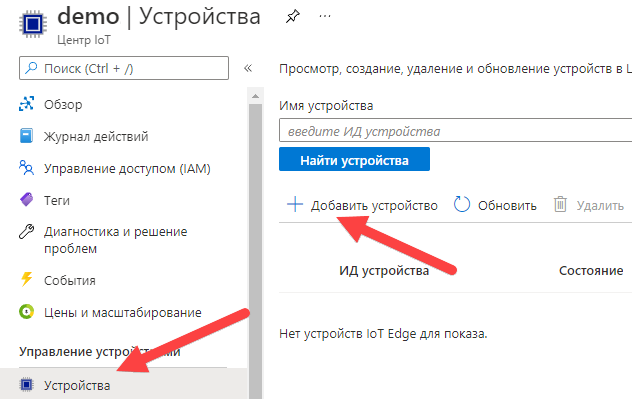
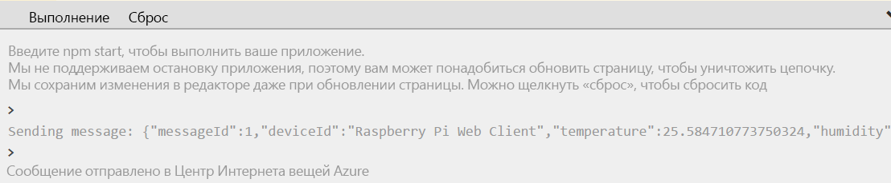

---
wts:
    title: '07 — внедрение Центра Интернета вещей Azure (10 мин)'
    module: 'Модуль 03. Описание основных решений и средств управления'
---
# 07 — внедрение Центра Интернета вещей Azure

В этом пошаговом руководстве мы настроим новый Центр Интернета вещей Azure на портале Azure, а затем проверим подлинность подключения к устройству Интернета вещей с помощью онлайн-симулятора устройства Raspberry Pi. Данные датчиков и сообщения передаются из симулятора Raspberry Pi в ваш Центр Интернета вещей Azure, и вы просматриваете метрики по обмену сообщениями на портале Azure.

# Задача 1. Создание центра Интернета вещей (10 мин)

В рамках этой задачи мы создадим центр Интернета вещей. 

1. Войдите на [портал Azure](https://portal.azure.com).

2. В колонке **Все службы** найдите и выберите элемент **Центр Интернета вещей**, а затем щелкните **+ Добавить, + Создать или + Новый**.

3. На вкладке **Основные** колонки **Центр Интернета вещей** укажите в полях следующие сведения (замените **xxxx** в имени учетной записи хранения буквами и цифрами, чтобы имя было глобально уникальным):

    | Параметры | Значение |
    |--|--|
    | Подписка | **Выберите свою подписку.** |
    | Группа ресурсов |  **myRGIoT** (создайте новую)|
    | Регион | **Восточная часть США** |
    | Имя центра Интернета вещей | **my-hub-groupxxxx** |
    | | |

    **Примечание.** -  Не забудьте заменить символы **xxxx**, чтобы **Имя центра Интернета вещей** стало уникальным.

4. Перейдите на вкладку **Управление** и используйте раскрывающийся список, чтобы установить для параметра **Ценовая категория и категория масштабирования** значение **S1: Уровень "Стандартный"**.

5. Нажмите кнопку **Просмотр и создание**.

6. Нажмите кнопку **Создать**, чтобы начать создание экземпляра Центра Интернета вещей Azure.

7. Дождитесь развертывания экземпляра Центра Интернета вещей Azure. 

# Задача 2. Добавление устройства Интернета вещей

В рамках этой задачи мы добавим устройство Интернета вещей в центр Интернета вещей. 

1. После завершения развертывания щелкните **Перейти к ресурсу** в колонке развертывания. Либо в колонке **Все службы** найдите и выберите элемент **Центр Интернета вещей** и найдите свой новый экземпляр Центра Интернета вещей.

	

2. Чтобы добавить новое устройство Интернета вещей, прокрутите вниз до раздела **Обозреватели** и щелкните **Устройства Интернета вещей**. Затем нажмите кнопку **+ Создать**.

	

3. Введите имя для своего нового устройства Интернета вещей — **myRaspberryPi** — и нажмите кнопку **Сохранить**. При этом будет создано удостоверение устройства Интернета вещей в вашем Центре Интернета вещей Azure.

4. Если вы не видите свое новое устройство, нажмите кнопку **Обновить** для обновления страницы "Устройства Интернета вещей". 

5. Выберите **myRaspberryPi** и скопируйте значение **Основная строка подключения**. Вы будете использовать этот ключ в следующей задаче для проверки подлинности подключения к симулятору Raspberry Pi.

	

# Задача 3. Тестирование устройства с помощью симулятора Raspberry Pi

В рамках этой задачи мы протестируем устройство с помощью симулятора Raspberry Pi. 

1. Откройте в веб-браузере новую вкладку и перейдите к [онлайн-симулятору Raspberry Pi](https://azure-samples.github.io/raspberry-pi-web-simulator/#Getstarted). 

2. Изучите сведения о симуляторе Raspberry Pi. Если появляется всплывающее окно обзора, выберите "**X**", чтобы закрыть его.

3. В области кода справа найдите строку с "const connectionString =". Замените ее строкой подключения, скопированной на портале Azure. Обратите внимание, что строка подключения включает в себя записи DeviceId (**myRaspberryPi**) и SharedAccessKey.

	

4. Щелкните **Выполнить** (под областью кода), чтобы запустить приложение. В выходных данных консоли должны отображаться данные датчиков и сообщения, отправляемые симулятором Raspberry Pi в ваш Центр Интернета вещей Azure. Данные и сообщения отправляются каждый раз, когда мигает светодиод симулятора Raspberry Pi. 

	

5. Нажмите кнопку **Остановить**, чтобы прекратить отправку данных.

6. Вернитесь на портал Azure и в свой Центр Интернета вещей.

7. Переключитесь на колонку **Обзор** Центра Интернета вещей и прокрутите вниз до пункта **Использование Центра Интернета вещей**.

	

Поздравляем! Вы настроили Центр Интернета вещей Azure для сбора данных датчиков с устройства Интернета вещей.

**Примечание**. Эту группу ресурсов можно удалить во избежание дополнительных затрат. Выполните поиск по группам ресурсов, выберите свою группу и щелкните **Удалить группу ресурсов**. Проверьте имя группы ресурсов и выберите **Удалить**. Следите за областью **Уведомления**  для отслеживания процесса удаления.
