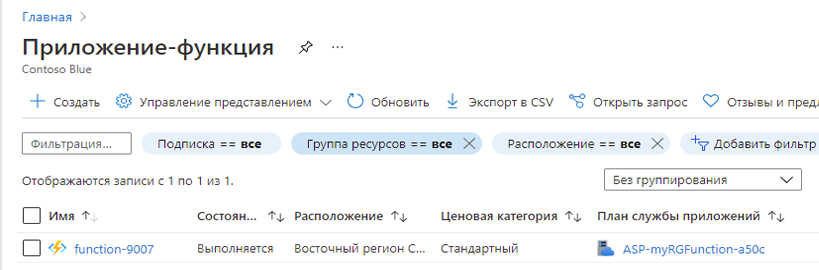
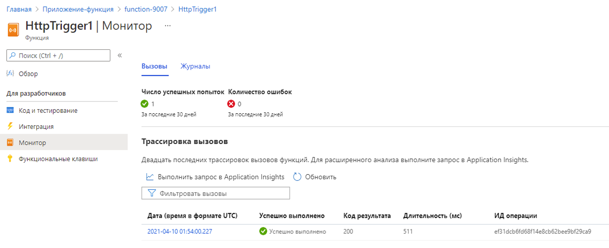

---
wts:
    title: '08 — внедрение Функций Azure (5 мин)'
    module: 'Модуль 03. Описание основных решений и средств управления'
---
# 08 — внедрение Функций Azure

В этом пошаговом руководстве мы создадим приложение-функцию для отображения приветственного сообщения Hello при выполнении HTTP-запроса. 

# Задача 1. Создание приложения-функции (5 мин)

В рамках этой задачи мы создадим приложение-функцию.

1. Войдите на [портал Azure](https://portal.azure.com).

1. В текстовом поле **Поиск ресурсов, служб и документов** в верхней части портала найдите и выберите элемент **Приложение-функция**, а затем в колонке **Приложение-функция** щелкните **+ Добавить, + Создать или + Новый**.

1. На вкладке **Основные** в колонке **Приложение-функция** укажите следующие параметры (замените **xxxx** в имени приложения-функции буквами и цифрами, чтобы имя было глобально уникальным, а для остальных параметров оставьте значения по умолчанию). 

    | Параметры | Значение |
    | -- | --|
    | Подписка | имя вашей подписки Azure |
    | Группа ресурсов | имя новой группы ресурсов **myRGFunction** |
    | Имя приложения-функции | **function-xxxx** |
    | Опубликовать | **Код** |
    | Стек времени выполнения | **.NET** |
    | Версия | **3.1** |
    | Регион | **Восточная часть США** |
    | | |

    **Примечание.** -  Не забудьте заменить символы **xxxx**, чтобы **Имя приложения-функции** стало уникальным.

1. Щелкните **Просмотр и создание** и после успешной проверки нажмите кнопку **Создать**, чтобы начать подготовку и развертывание нового приложения-функции Azure.

1. Дождитесь уведомления о создании ресурса.

1. Вернитесь к колонке **Приложение-функция**, нажмите кнопку **Обновить** и убедитесь, что вновь созданное приложение-функция имеет состояние **Выполняется**. 

    

# Задача 2. Создание функции, активируемой HTTP, и тест

В рамках этой задачи мы будем использовать функцию "Веб-перехватчик + API" для отображения сообщения при выполнении HTTP-запроса. 

1. В колонке **Приложение-функция** щелкните созданное приложение-функцию. 

1. В колонке приложения-функции в разделе **Функции** щелкните **Функции**, а затем нажмите кнопку **+ Добавить**.

    

1. В разделе **Выберите шаблон** в колонке **Добавить функцию** щелкните **Триггер HTTP**, в разделе **Сведения о шаблоне** примите значения по умолчанию, а затем нажмите кнопку **Добавить**.

1. В колонке **HttpTrigger1** в разделе **Разработчик** щелкните **Code + Test** (Код и тест). 

1. В колонке **HttpTrigger1\| Code + Test** (Код и тест) просмотрите автоматически сгенерированный код и обратите внимание на то, что код предназначен для выполнения HTTP-запроса и регистрации информации. Также обратите внимание, что функция возвращает сообщение Hello с именем. 

    

1. Нажмите кнопку **Получить URL-адрес функции** в верхней части редактора функций. 

1. Задайте в раскрывающемся списке **Клавиша** значение **по умолчанию** и нажмите кнопку **Копировать**, чтобы скопировать URL-адрес функции. 

    

1. Откройте в браузере новую вкладку и вставьте скопированный URL-адрес функции в адресную строку. При запросе страницы запускается функция. Обратите внимание на возвращенное сообщение о том, что функции требуется имя в тексте запроса.

    

1. Добавьте **&name=*ваше_имя*** в конец URL-адреса.

    **Примечание**. Замените ***ваше_имя*** своим именем. Например, для имени Синди конечный URL-адрес будет иметь следующий вид: `https://azfuncxxx.azurewebsites.net/api/HttpTrigger1?code=X9xx9999xXXXXX9x9xxxXX==&name=cindy`

    

1. Когда ваша функция запускается, отслеживается каждый вызов. Чтобы просмотреть трассировки на портале Azure, вернитесь в колонку **HttpTrigger1 \| Code + Test** (Код и тест) и щелкните **Мониторинг**.

     

Поздравляем! Вы создали приложение-функцию для отображения приветственного сообщения Hello при выполнении HTTP-запроса. 

**Примечание**. Эту группу ресурсов можно удалить во избежание дополнительных затрат. Выполните поиск по группам ресурсов, выберите свою группу и щелкните **Удалить группу ресурсов**. Проверьте имя группы ресурсов и выберите **Удалить**. Следите за областью **Уведомления** для отслеживания процесса удаления.
