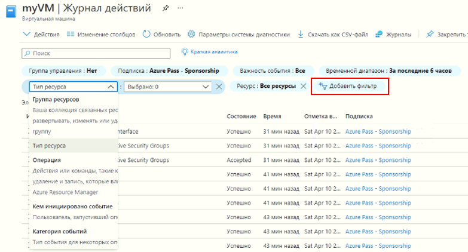

---
wts:
    title: '09 — Создание виртуальной машины с использованием шаблона (10 мин)'
    module: 'Модуль 03. Описание основных решений и средств управления'
---
# 09 — Создание виртуальной машины с использованием шаблона (10 мин)

В этом пошаговом руководстве мы развернем виртуальную машину с помощью шаблона быстрого запуска и рассмотрим возможности мониторинга.

# Задача 1. Изучите галерею QuickStart и определите местоположение шаблона. 

В рамках этой задачи мы просмотрим коллекцию шаблонов быстрого запуска Azure и развернем шаблон, создающий виртуальную машину. 

1. Откройте в лабораторной среде новое окно браузера и введите T https://azure.microsoft.com/ru-ru/resources/templates/?azure-portal=true. Там вы увидите ряд популярных и недавно обновленных шаблонов. Они автоматизируют развертывание ресурсов Azure, включая установку популярных программных пакетов. Просмотрите разные типы шаблонов, которые вам доступны.

3. Выберите **Развертывание простой ВМ Windows**

4. Нажмите кнопку **Развернуть в Azure**. Ваш сеанс браузера будет автоматически перенаправлен на [портал Azure](http://portal.azure.com/).

  **Примечание**. Нажав кнопку **Развертывание в Azure**, можно развернуть шаблон через портал Azure. Во время такого развертывания вам будет доступен лишь небольшой набор параметров конфигурации. 

5. При появлении соответствующего запроса войдите в свою подписку Azure с учетными данными, предоставленными ранее в инструкциях.

6. Щелкните **Изменить шаблон**. В качестве формата шаблона Resource Manager используется формат JSON. Просмотрите параметры и переменные.  После этого найдите параметр для имени виртуальной машины. Измените имя на **myVMTemplate**. **Сохраните** изменения. 

    

7. Теперь настройте параметры, необходимые для шаблона (замените ***xxxx*** в префиксе DNS-метки буквами и цифрами, чтобы имя было глобально уникальным). Для остальных параметров оставьте значения по умолчанию. 

    | Параметр| Значение|
    |----|----|
    | Подписка | **Сохранить предоставленное по умолчанию**|
    | Группа ресурсов | **Создание новой группы ресурсов** |
    | Регион | Сохранить по умолчанию |
    | Имя администратора | **azureuser** |
    | Пароль администратора | **Pa$$w0rd1234** |
    | Префикс DNS-метки | **myvmtemplatexxxx** |
    | Версия ОС | **2019-Datacenter** |

9. Щелкните **Просмотр и создание**.

10. Следите за развертыванием. 

# Задача 2. Проверка и мониторинг развертывания виртуальной машины

В рамках этой задачи мы проверим правильность развертывания виртуальной машины. 

1. В колонке **Все службы** найдите и выберите элемент **Виртуальные машины**.

2. Убедитесь, что виртуальная машина создана. 

    

3. Выберите свою виртуальную машину и в области **Обзор** выберите вкладку **Отслеживание**, прокрутите вниз, чтобы просмотреть данные мониторинга.

    **Примечание**. Временной интервал мониторинга можно регулировать в пределах от одного часа до 30 дней.

4. Просмотрите различные представленные диаграммы, включая **Средняя загрузка ЦП**, **Сеть (общая)** и **Байт диска (всего)**. 

    

5. Щелкните любую диаграмму. Обратите внимание, что можно **Добавить метрику** и изменить тип диаграммы.

6. Вернитесь в колонку **Обзор**. (сдвиньте панель переключателя влево)
7. Щелкните **Журнал действий** (на левой панели). Журналы действий регистрируют такие события, как создание или изменение ресурсов. 

8. Щелкните **Добавить фильтр** и поэкспериментируйте с поиском различных типов событий и операций. 

    

Поздравляем! Вы успешно создали ресурс из шаблона и выполнили развертывание этого шаблона в Azure.

**Примечание**. Во избежание дополнительных затрат эту группу ресурсов можно удалить. Выполните поиск по группам ресурсов, выберите свою группу и щелкните **Удалить группу ресурсов**. Проверьте имя группы ресурсов и выберите **Удалить**. Следите за областью **Уведомления** для отслеживания процесса удаления.
