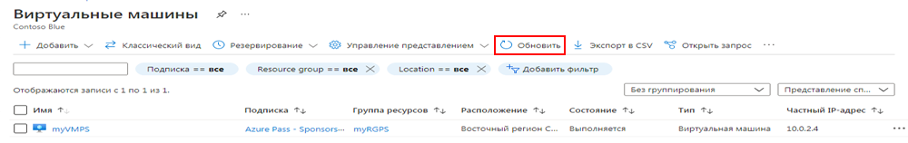
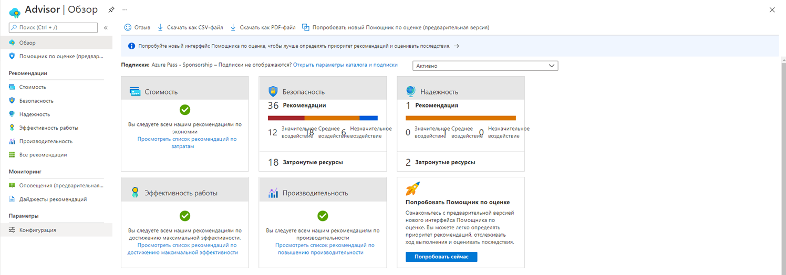

---
wts:
    title: '10 — создание виртуальной машины с использованием PowerShell (10 мин)'
    module: 'Модуль 03. Описание основных решений и средств управления'
---
# 10 — создание виртуальной машины с использованием PowerShell

В этом пошаговом руководстве мы настроим Cloud Shell, воспользуемся модулем Azure PowerShell для создания группы ресурсов и виртуальной машины, а также рассмотрим рекомендации Помощника по Azure. 

# Задача 1. Настройка Cloud Shell (10 мин)

В рамках этой задачи мы настроим Cloud Shell. 

1. Войдите на [портал Azure](https://portal.azure.com).

2. На портале Azure откройте **Azure Cloud Shell**, щелкнув значок в правом верхнем углу портала Azure.

    

3. Если ранее вы уже пользовались Cloud Shell, перейдите к следующей задаче. 

4. Когда будет предложено выбрать **Bash** или **PowerShell**, выберите **PowerShell**.

5. При появлении запроса щелкните **Создать хранилище** и дождитесь инициализации Azure Cloud Shell. 

# Задача 2. Создание группы ресурсов и виртуальной машины

В этой задаче мы будем использовать PowerShell для создания группы ресурсов и виртуальной машины.  

1. Выберите **PowerShell** в верхнем левом раскрывающемся меню на панели Cloud Shell.

2. В сеансе PowerShell на панели Cloud Shell создайте группу ресурсов. 

    ```PowerShell
    New-AzResourceGroup -Name myRGPS -Location EastUS
    ```

3. Проверьте новую группу ресурсов. 

    ```PowerShell
    Get-AzResourceGroup | Format-Table
    ```

4. Создайте виртуальную машину. При появлении запроса укажите имя пользователя (**azureuser**) и пароль (**Pa$$w0rd1234**), которые будут настроены в качестве учетной записи локального администратора на этих виртуальных машинах. Включайте символы галочки (`) в конце каждой строки, кроме последней (при вводе всей команды на одной строке никаких символов галочки быть не должно).

    ```PowerShell
    New-AzVm `
    -ResourceGroupName "myRGPS" `
    -Name "myVMPS" `
    -Location "East US" `
    -VirtualNetworkName "myVnetPS" `
    -SubnetName "mySubnetPS" `
    -SecurityGroupName "myNSGPS" `
    -PublicIpAddressName "myPublicIpPS"
    ```
** Дождитесь развертывания виртуальной машины, прежде чем закрывать PowerShell.

5. Закройте панель Cloud Shell сеанса PowerShell.

6. На портале Azure выполните поиск элемента **Виртуальные машины** и убедитесь, что **myVMPS** выполняется. Это может занять несколько минут.

    

7. Получите доступ к новой виртуальной машине и просмотрите параметры "Обзор" и "Сеть", чтобы убедиться, что ваша информация была развернута правильно. 

# Задача 3. Выполнение команд в Cloud Shell

В рамках этой задачи мы попрактикуемся в выполнении команд PowerShell из Cloud Shell. 

1. На портале Azure откройте **Azure Cloud Shell**, щелкнув значок в правом верхнем углу портала Azure.

2. Выберите **PowerShell** в верхнем левом раскрывающемся меню на панели Cloud Shell.

3. Извлеките информацию о вашей виртуальной машине, включая имя, группу ресурсов, расположение и состояние. Обратите внимание, что состояние питания имеет значение **Выполняется**.

    ```PowerShell
    Get-AzVM -name myVMPS -status | Format-Table -autosize
    ```

4. Остановите виртуальную машину. При появлении запроса подтвердите действие ("Да"). 

    ```PowerShell
    Stop-AzVM -ResourceGroupName myRGPS -Name myVMPS
    ```

5. Проверьте состояние вашей виртуальной машины. Теперь состояние питания должно иметь значение **Освобождено**. Вы также можете проверить состояние виртуальной машины на портале. 

    ```PowerShell
    Get-AzVM -name myVMPS -status | Format-Table -autosize
    ```

# Задача 4. Ознакомление с рекомендациями Помощника по Azure

**Примечание.** Эта же задача приведена в задании "Создание виртуальной машины с использованием Azure CLI". 

В рамках этой задачи мы рассмотрим рекомендации Помощника по Azure для нашей виртуальной машины. 

1. В колонке **Все службы** найдите и выберите элемент **Помощник**. 

2. В колонке **Помощник** выберите **Обзор**. Рекомендации сгруппированы по категориям "Высокая доступность", "Безопасность", "Производительность" и "Стоимость". 

    

3. Выберите **Все рекомендации** и уделите время просмотру каждой рекомендации и предлагаемых действий. 

    **Примечание.** В зависимости от ваших ресурсов рекомендации будут различаться. 

    

4. Обратите внимание, что вы можете скачать рекомендации в виде файла CSV или PDF. 

5. Обратите внимание, что вы можете создавать оповещения. 

6. Если у вас есть время, продолжайте экспериментировать с Azure PowerShell. 

Поздравляем! Вы настроили Cloud Shell, создали виртуальную машину с помощью PowerShell, попрактиковались с командами PowerShell и просмотрели рекомендации Помощника.

**Примечание**. Эту группу ресурсов можно удалить во избежание дополнительных затрат. Выполните поиск по группам ресурсов, выберите свою группу и щелкните **Удалить группу ресурсов**. Проверьте имя группы ресурсов и выберите **Удалить**. Следите за областью **Уведомления** для отслеживания процесса удаления.
