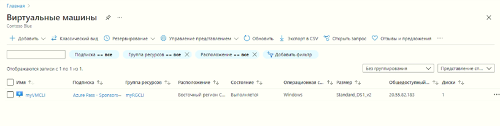
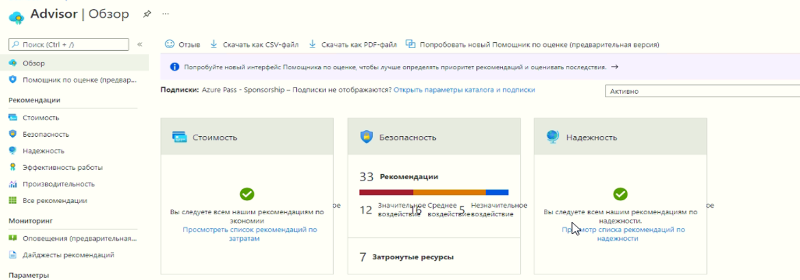
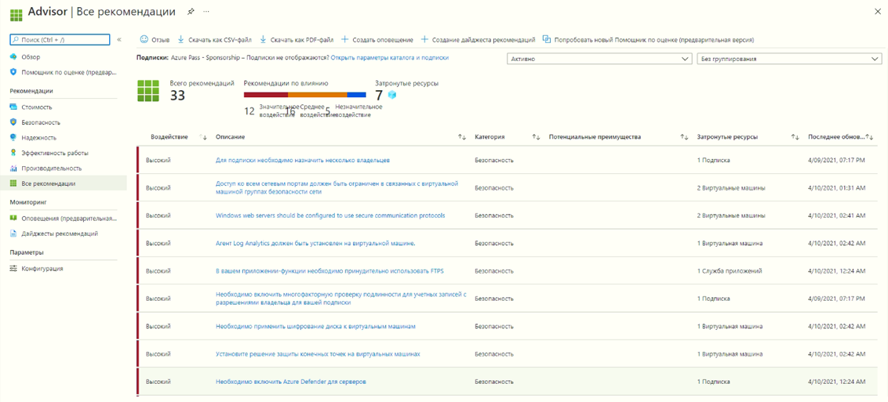

---
wts:
    title: '11 — создание виртуальной машины с использованием CLI (10 мин)'
    module: 'Модуль 03. Описание основных решений и средств управления'
---
# 11 — создание виртуальной машины с использованием CLI

В этом пошаговом руководстве мы настроим Cloud Shell, воспользуемся Azure CLI для создания группы ресурсов и виртуальной машины, а также рассмотрим рекомендации Помощника по Azure. 

# Задача 1. Настройка Cloud Shell (10 мин)

В рамках этой задачи мы настроим Cloud Shell. 

1. Войдите на [портал Azure](https://portal.azure.com).

2. На портале Azure откройте **Azure Cloud Shell**, щелкнув значок в правом верхнем углу портала Azure.

    

3. Если ранее вы уже пользовались Cloud Shell, перейдите к следующей задаче. 

4. Когда будет предложено выбрать **Bash** или **PowerShell**, выберите **Bash**. 

5. При появлении запроса щелкните **Создать хранилище** и дождитесь инициализации Azure Cloud Shell. 

# Задача 2. Создание группы ресурсов и виртуальной машины

В этой задаче мы будем использовать Azure CLI для создания группы ресурсов и виртуальной машины.  

1. Выберите **Bash** в верхнем левом раскрывающемся меню на панели Cloud Shell.

    

2. В сеансе Bash на панели Cloud Shell создайте группу ресурсов. 

    ```cli
    az group create --name myRGCLI --location EastUS
    ```

3. Убедитесь, что группа ресурсов создана.

    ```cli
    az group list --output table
    ```

4. Создайте виртуальную машину. Убедитесь, что после каждой строки, кроме последней, стоит символ обратной косой черты (`\`). Если вы вводите всю команду на одной строке, не используйте символы обратной косой черты. 

    ```cli
    az vm create \
    --name myVMCLI \
    --resource-group myRGCLI \
    --image UbuntuLTS \
    --location EastUS \
    --admin-username azureuser \
    --admin-password Pa$$w0rd1234
    ```

    >**Примечание**. Если вы используете командную строку на компьютере с Windows, замените обратную косую черту (`\`) символом крышки (`^`).
    
    **Примечание**. Выполнение команды займет от 2 до 3 минут. Команда создаст виртуальную машину и различные связанные с ней ресурсы, такие как ресурсы хранилища, сети и безопасности. Не переходите к следующему шагу, пока развертывание виртуальной машины не будет завершено. 

5. Когда команда завершит выполнение, закройте панель Cloud Shell в окне браузера.

6. На портале Azure выполните поиск элемента **Виртуальные машины** и убедитесь, что **myVMCLI** выполняется.

    


# Задача 3. Выполнение команд в Cloud Shell

В рамках этой задачи мы попрактикуемся в выполнении команд CLI из Cloud Shell. 

1. На портале Azure откройте **Azure Cloud Shell**, щелкнув значок в правом верхнем углу портала Azure.

2. Выберите **Bash** в верхнем левом раскрывающемся меню на панели Cloud Shell.

3. Извлеките информацию о подготовленной вами виртуальной машине, включая имя, группу ресурсов, расположение и состояние. Обратите внимание, что состояние питания имеет значение **Выполняется**.

    ```cli
    az vm show --resource-group myRGCLI --name myVMCLI --show-details --output table 
    ```

4. Остановите виртуальную машину. Обратите внимание на сообщение о том, что выставление счетов продолжается до тех пор, пока виртуальная машина не будет освобождена. 

    ```cli
    az vm stop --resource-group myRGCLI --name myVMCLI
    ```

5. Проверьте состояние вашей виртуальной машины. Теперь состояние питания должно иметь значение **Остановлено**.

    ```cli
    az vm show --resource-group myRGCLI --name myVMCLI --show-details --output table 
    ```

# Задача 4. Ознакомление с рекомендациями Помощника по Azure

В рамках этой задачи мы рассмотрим рекомендации Помощника по Azure.

   **Примечание.** Если вы завершили предыдущее задание ("Создание виртуальной машины с помощью PowerShell"), значит, вы уже выполнили эту задачу. 

1. В колонке **Все службы** найдите и выберите элемент **Помощник**. 

2. В колонке **Помощник** выберите **Обзор**. Рекомендации сгруппированы по категориям "Высокая доступность", "Безопасность", "Производительность" и "Стоимость". 

    

3. Выберите **Все рекомендации** и уделите время просмотру каждой рекомендации и предлагаемых действий. 

    **Примечание.** В зависимости от ваших ресурсов рекомендации будут различаться. 

    

4. Обратите внимание, что вы можете скачать рекомендации в виде файла CSV или PDF. 

5. Обратите внимание, что вы можете создавать оповещения. 

6. Если у вас есть время, продолжайте экспериментировать с Azure CLI. 

Поздравляем! Вы настроили Cloud Shell, создали виртуальную машину с помощью Azure CLI, попрактиковались с командами Azure CLI и просмотрели рекомендации Помощника.

**Примечание**. Эту группу ресурсов можно удалить во избежание дополнительных затрат. Выполните поиск по группам ресурсов, выберите свою группу и щелкните **Удалить группу ресурсов**. Проверьте имя группы ресурсов и выберите **Удалить**. Следите за областью **Уведомления** для отслеживания процесса удаления.
