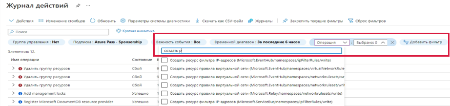

---
wts:
    title: '14 — управление доступом с помощью RBAC (5 мин)'
    module: 'Модуль 05. Описание функций идентификации, управления, конфиденциальности и соответствия требованиям'
---
# 14 — Управление доступом с помощью RBAC (5 мин)

В этом пошаговом руководстве мы назначим ресурсам роли с разрешениями и просмотрим журналы.

# Задача 1. Просмотр и назначение ролей

В рамках этой задачи мы назначим роль участника виртуальных машин. 

1. Войдите на [портал Azure](https://portal.azure.com).

2. В колонке **Все службы** найдите и выберите элемент **Группы ресурсов**, а затем выберите **+ Добавить + Новый + Создать**.

3. Создайте группу ресурсов. По завершении нажмите кнопку **Создать**. 

    | Параметр | Значение |
    | -- | -- |
    | Подписка | **Использовать предоставленное по умолчанию** |
    | Группа ресурсов | **myRGRBAC** |
    | Регион | **(США) Восточная часть США** |
   

4. Нажмите кнопку **Просмотр и создание**, а затем кнопку **Создать**.

5. **Обновите** страницу группы ресурсов и щелкните запись, представляющую только что созданную группу ресурсов.

6. Щелкните колонку **Управление доступом (IAM)**, а затем перейдите на вкладку **Роли**. Прокрутите большое количество доступных определений ролей. Используйте информационные значки, чтобы узнать о разрешениях каждой роли. Обратите внимание, что также доступна информация о количестве пользователей и групп, назначенных каждой роли.

    

7. Перейдите на вкладку **Назначения ролей** в колонке **myRGRBAC — Управление доступом (IAM)**, щелкните **+ Добавить** и затем **Добавить назначение ролей**. Назначьте роль участника виртуальных машин своей учетной записи, а затем нажмите кнопку **Сохранить**. 

    | Параметр | Значение |
    | -- | -- |
    | Роль | **Участник виртуальных машин** |
    | Назначение доступа к | **пользователь, группа или субъект-служба** |
    | Выберите | **Добавление учетной записи пользователя** |
 

    **Примечание.** Роль участника виртуальных машин позволяет вам управлять виртуальными машинами, но не позволяет получить доступ к их операционной системе или управлять виртуальной сетью и учетной записью хранения, к которым они подключены.

    

8. **Обновите** страницу назначения ролей и убедитесь, что теперь вы указаны как "Участник виртуальных машин". 

    **Примечание**. Это назначение фактически не дает вам никаких дополнительных привилегий, так как ваша учетная запись уже имеет роль "Владелец", которая включает в себя все привилегии, связанные с ролью "Участник".

# Задача 2. Отслеживание назначений ролей и удаление роли

В рамках этой задачи мы просмотрим журнал действий, чтобы проверить назначение ролей, а затем удалим роль. 

1. В колонке группы ресурсов myRGRBAC щелкните **Журнал действий**.

2. Щелкните **Добавить фильтр**, выберите **Операция**, а затем **Создать назначение роли**.

    

3. Убедитесь, что в журнале действий отображается ваше назначение ролей. 

    **Примечание**. Можете ли вы разобраться, как удалить свою роль?

Поздравляем! Вы создали группу ресурсов, назначили ей роль доступа и просмотрели журналы действий. 

**Примечание**. Эту группу ресурсов можно удалить во избежание дополнительных затрат. Выполните поиск по группам ресурсов, выберите свою группу и щелкните **Удалить группу ресурсов**. Проверьте имя группы ресурсов и выберите **Удалить**. Следите за областью **Уведомления** для отслеживания процесса удаления.

