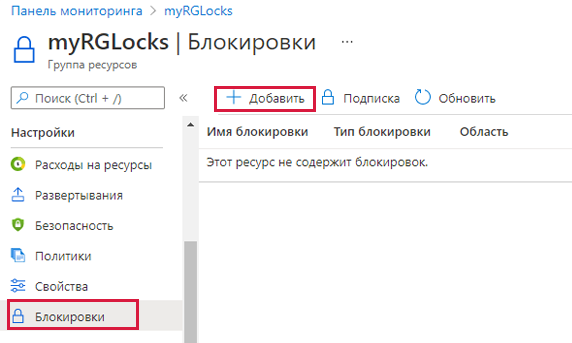
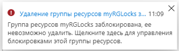

---
wts:
    title: '15 — управление блокировками ресурсов (5 мин)'
    module: 'Модуль 05. Описание функций идентификации, управления, конфиденциальности и соответствия требованиям'
---
# 15 — Управление блокировками ресурсов (5 мин)

В этом пошаговом руководстве мы добавим блокировку для группы ресурсов и проверим удаление этой группы ресурсов. Блокировки можно применять в подписке по отношению к группам ресурсов или отдельным ресурсам, чтобы предотвратить случайное удаление или изменение критически важных ресурсов.  

# Задача 1.  Добавление блокировки для группы ресурсов и проверка удаления

В рамках этой задачи мы добавим блокировку ресурса для группы ресурсов и проверим удаление этой группы ресурсов. 

1. Войдите на [портал Azure](https://portal.azure.com).

2. На портале Azure перейдите к группе ресурсов **myRGLocks**.

3. Вы можете применить блокировку к подписке, группе ресурсов или отдельному ресурсу, чтобы предотвратить случайное удаление или изменение критически важных ресурсов. 

4. В разделе **Параметры** щелкните **Блокировки**, а затем щелкните **+ Добавить**. 

    

5. Настройте новую блокировку. Закончив, нажмите кнопку **ОК**. 

    | Параметр | Значение |
    | -- | -- |
    | Имя блокировки | '''RGLock''' |
    | Тип блокировки | **Удаление** |
    | | |

6. Щелкните **Обзор** и **Удалить группу ресурсов**. Введите имя группы ресурсов и нажмите кнопку **ОК**. Отображается сообщение об ошибке, где сказано, что группа ресурсов заблокирована и не может быть удалена.

    

# Задача 2. Проверка удаления члена группы ресурсов

В рамках этой задачи мы проверим, защищает ли блокировка ресурса учетную запись хранения в группе ресурсов. 

1. В колонке **Все службы** найдите и выберите элемент **Учетные записи хранения**, а затем щелкните **+ Добавить, + Создать или + Новый**. 

2. В колонке **+Добавить +Новый +Создать** на странице **Учетные записи хранения** укажите следующие сведения (замените **xxxx** в имени учетной записи хранения буквами и цифрами, чтобы имя было глобально уникальным). Для остальных параметров оставьте значения по умолчанию.

    | Параметр | Значение | 
    | --- | --- |
    | Подписка | **Выберите свою подписку** |
    | Группа ресурсов | **myRGLocks** |
    | Имя учетной записи хранения | **storageaccountxxxx** |
    | Расположение | **(США) Восточная часть США**  |
    | Производительность | **стандартная** |
    | Тип учетной записи | **StorageV2 (учетная запись общего назначения версии 2)** |
    | Репликация | **Локально избыточное хранилище (LRS)** |
    | Уровень доступа (по умолчанию) | **Горячий** |
   

3. Щелкните **Просмотр и создание**, чтобы просмотреть параметры учетной записи хранения и разрешить Azure проверить конфигурацию. 

4. После проверки нажмите кнопку **Создать**. Дождитесь уведомления об успешном создании учетной записи. 

5.  Дождитесь уведомления об успешном создании учетной записи хранения. 

6. Откройте новую учетную запись хранения и на панели **Обзор** щелкните **Удалить**. Отображается сообщение об ошибке, где сказано, что ресурс или его родительский объект имеют блокировку удаления. 

    

    **Примечание**. Хотя мы не создавали блокировку специально для учетной записи хранения, мы создали блокировку на уровне группы ресурсов, которая содержит эту учетную запись хранения. Таким образом, эта блокировка *родительского* уровня не позволяет нам удалить ресурс, а учетная запись хранения наследует блокировку от родительского объекта.

# Задача 3. Снятие блокировки ресурса

В рамках этой задачи мы снимем блокировку ресурса и проведем проверку. 

1. Вернитесь к колонке группы ресурсов **myRGLocks-XXXXXXXX** и в разделе **Параметры** щелкните **Блокировки**.
    
2. Щелкните ссылку **Удалить**, которая является крайней справа от записи **myRGLocks-XXXXXXXX** и находится справа от элемента **Изменить**.

    

3. Вернитесь в колонку учетной записи хранения и подтвердите, что теперь ресурс можно удалить.

Поздравляем! Вы создали группу ресурсов, добавили блокировку для группы ресурсов и проверили удаление, затем проверили удаление ресурса в группе ресурсов и сняли блокировку ресурса. 

**Примечание**. Эту группу ресурсов можно при желании удалить во избежание дополнительных затрат. Выполните поиск по группам ресурсов, выберите свою группу и щелкните **Удалить группу ресурсов**. Проверьте имя группы ресурсов и выберите **Удалить**. Следите за областью **Уведомления** для отслеживания процесса удаления.
