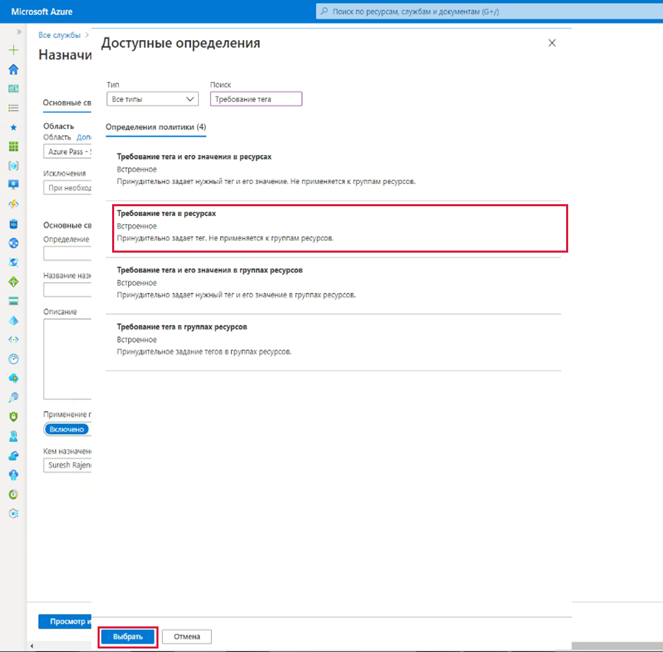
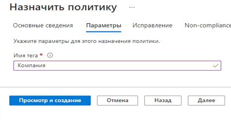
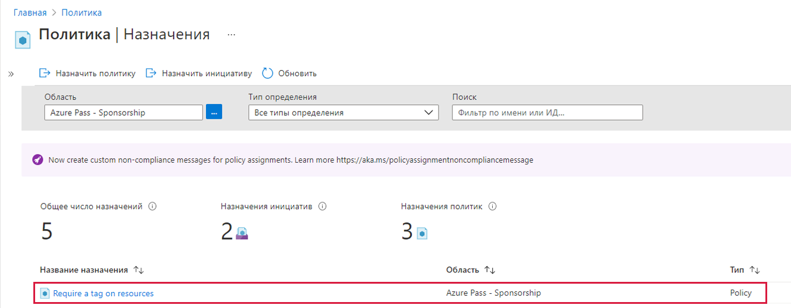
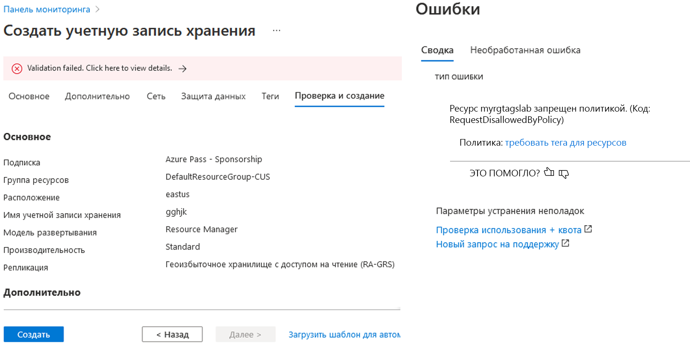
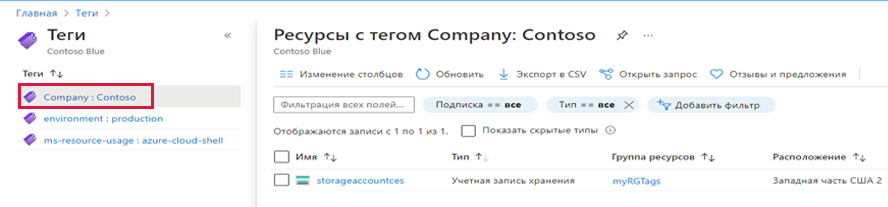
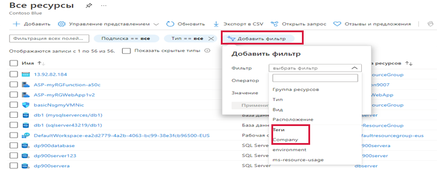

---
wts:
    title: '16 — реализация расстановки тегов для ресурсов (5 мин)'
    module: 'Модуль 05. Описание функций идентификации, управления, конфиденциальности и соответствия требованиям'
---
# 16 — Реализация расстановки тегов для ресурсов (5 мин)

В этом пошаговом руководстве мы создадим назначение политики, которое требует расстановки тегов, создадим учетную запись хранения и проверим расстановку тегов, просмотрим ресурсы с указанным тегом, а также удалим политику расстановки тегов.

# Задача 1. Создание назначения политики 

В рамках этой задачи мы настроим политику **Требование тега в ресурсах** и назначим ее своей подписке. 

1. Войдите на [портал Azure](https://portal.azure.com).

2. В колонке **Все службы** найдите и выберите элемент **Политика**.

3. Прокрутите вниз до раздела **Разработка**, щелкните **Назначения**, а затем щелкните **Назначить политику** в верхней части страницы.

4. Обратите внимание, что **Область** нашей политики будет распространяться на всю подписку. 

5. В разделе **Основные** выберите кнопку с многоточием **Определение политики** (правая сторона текстового поля). В поле **Поиск** введите значение **тег**. Появится список связанных политик со словом **тег**. Прокрутите вниз до определения **Требование тега в ресурсах**, щелкните его и нажмите кнопку **Выбрать**.

   
   
6.  На вкладке **Параметры** введите **Company** (Компания) в качестве имени тега Нажмите кнопку **Просмотр и создание**, а затем кнопку **Создать**.

    

7. Назначение политики **Требование тега в ресурсах** теперь задано. При создании ресурс должен включать в себя тег с ключом "Company".
   **Примечание. Для применения политики нужно подождать вплоть до 30 минут.** 

   

# Задача 2. Создание учетной записи хранения для проверки требуемой расстановки тегов

В рамках этой задачи мы создадим учетные записи хранения, чтобы проверить требуемую расстановку тегов. 

1. На портале Azure в колонке **Все службы** найдите и выберите элемент **Учетные записи хранения**, а затем щелкните **+Добавить +Новый +Создать**.

2. На вкладке **Основные** в колонке **Создание учетной записи хранения** укажите следующие сведения (замените **xxxx** в имени учетной записи хранения буквами и цифрами, чтобы имя было глобально уникальным). Для остальных параметров оставьте значения по умолчанию.

    | Параметр | Значение | 
    | --- | --- |
    | Подписка | **Использовать предоставленное по умолчанию** |
    | Группа ресурсов | **Создание новой группы ресурсов** |
    | Имя учетной записи хранения | **storageaccountxxxx** |
    | Расположение | **(США) Восточная часть США** |

3. Щелкните **Просмотр и создание**. 

    **Примечание.** Мы проводим проверку, чтобы узнать, что происходит, когда тег не предоставлен. Обратите внимание, что может понадобиться вплоть до 30 минут, чтобы политики вступила в силу.

4. Вы получите сообщение об ошибке проверки. Щелкните сообщение **Для просмотра сведений щелкните здесь**. В колонке **Ошибки** на вкладке **Сводка** обратите внимание на сообщение об ошибке, в котором сказано, что ресурс был запрещен политикой.

    **Примечание.** Если вы просмотрите вкладку "Необработанная ошибка", то увидите конкретное имя тега, которое необходимо. 

    

5. Закройте панель **Ошибка** и нажмите кнопку **Назад** (внизу экрана). Предоставьте информацию о расстановке тегов. 

    | Параметр | Значение | 
    | --- | --- |
    | Имя тега | **Company** (может отсутствовать в раскрывающемся списке) |

6. Нажмите кнопку **Просмотр и создание** и убедитесь, что проверка прошла успешно. Нажмите кнопку **Создать**, чтобы развернуть учетную запись хранения. 

# Задача 3. Просмотр всех ресурсов с определенным тегом

1. На портале Azure в колонке **Все службы** найдите и выберите элемент **Теги**.

2. Просмотрите все теги и их значения. Щелкните пару "ключ-значение" **Company : Contoso**. Появится колонка, показывающая только что созданную учетную запись хранения, если вы включили этот тег во время ее развертывания. 

   

3. На портале откройте колонку **Все ресурсы**.

4. Щелкните **Добавить фильтр** и добавьте ключ тега **Company** в качестве категории фильтра. После применения фильтра в списке будет отображаться только ваша учетная запись хранения.

    

# Задача 4. Удаление назначения политики

В рамках этой задачи мы удалим политику **Требование тега в ресурсах**, чтобы она не влияла на нашу дальнейшую работу. 

1. На портале в колонке **Все службы** найдите и выберите элемент **Политика**.

2. Щелкните запись политики **Требование тега в ресурсах**.

3. Щелкните **Удалить назначение** в верхнем меню.

4. Подтвердите, что хотите удалить назначение политики в диалоговом окне **Удаление назначения**, нажав кнопку **Да**.

5. Если у вас есть время, создайте другой ресурс без тега, чтобы убедиться, что политика перестала действовать.

Поздравляем! В этом пошаговом руководстве мы создали назначение политики, которое требовало расстановки тегов, создали ресурс (учетную запись хранения) и проверили политику расстановки тегов, просмотрели ресурсы с указанным тегом, а также удалили политику расстановки тегов.

**Примечание**. Эту группу ресурсов можно при желании удалить во избежание дополнительных затрат. Выполните поиск по группам ресурсов, выберите свою группу и щелкните **Удалить группу ресурсов**. Проверьте имя группы ресурсов и выберите **Удалить**. Следите за областью **Уведомления** для отслеживания процесса удаления.
