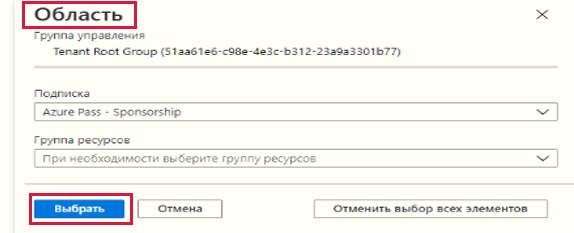
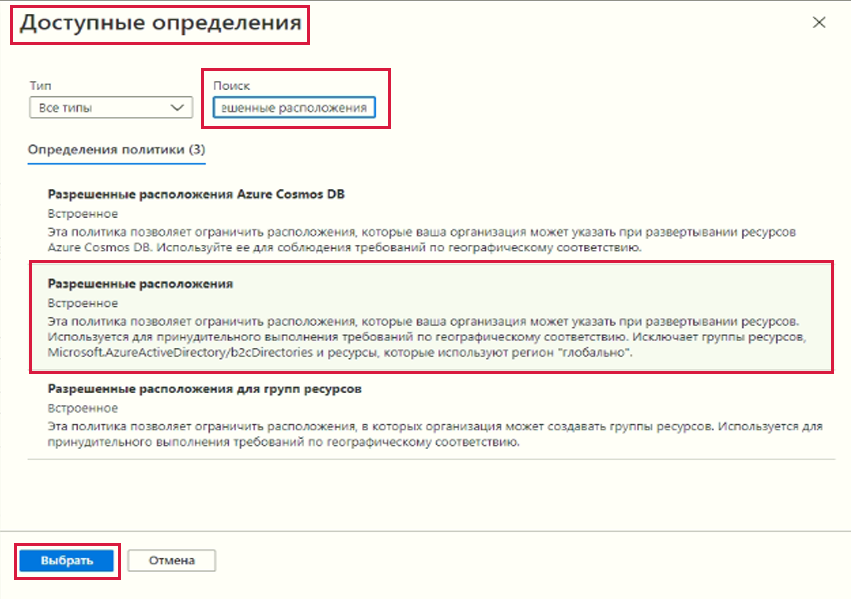

---
wts:
    title: '17 — создание политики Azure (10 мин)'
    module: 'Модуль 05. Описание функций идентификации, управления, конфиденциальности и соответствия требованиям'
---
# 17 — Создание политики Azure (10 мин)

В этом пошаговом руководстве мы создадим политику Azure, чтобы ограничить развертывание ресурсов Azure определенным расположением.

# Задача 1. Создание назначения политики 

В рамках этой задачи мы настроим политику разрешенного расположения и назначим ее своей подписке. 

1. Войдите на [портал Azure](https://portal.azure.com).

2. В колонке **Все службы** найдите и выберите элемент **Политика**, а затем в разделе **Разработка** щелкните **Определения**.  Уделите время изучению списка встроенных определений политик. Например, в раскрывающемся списке **Категория** выберите только **Вычисление**. Обратите внимание, что определение **Разрешенные размеры номеров SKU виртуальных машин** позволяет указать набор номеров SKU виртуальных машин, которые может развертывать ваша организация.

3. Вернитесь на страницу **Политика** и в разделе **Разработка** щелкните **Назначения**. Назначение — это политика, которая назначена в рамках определенной области. Например, определение может быть назначено области действия подписки. 

4. Щелкните **Назначить политику** вверху страницы **Политика — назначения**.

5. На странице **Назначить политику** сохраните область по умолчанию.

      | Параметр | Значение | 
    | --- | --- |
    | Область| **Использовать выбранное по умолчанию**|
    | Определение политики | Щелкните многоточие, затем выполните поиск **Разрешенных расположений**, а затем нажмите **Выбрать** |
    | Имя назначения | **Допустимые расположения** |
    
    
6. На вкладке **Параметры** выберите **Japan West**. Нажмите кнопку **Просмотр и создание**, а затем кнопку **Создать**.

    **Примечание**. Область определяет, к каким ресурсам или группе ресурсов применяется назначение политики. В нашем случае мы могли бы назначить эту политику определенной группе ресурсов, однако решили назначить ее на уровне подписки. Имейте в виду, что ресурсы могут быть исключены в зависимости от конфигурации области. Исключения не являются обязательными.

    **Примечание**. Это определение политики **Разрешенные расположения** определяет расположение, в котором должны быть развернуты все ресурсы. Если выбрано другое расположение, развертывание будет запрещено. Дополнительные сведения см. на странице [Примеры политик Azure](https://docs.microsoft.com/ru-ru/azure/governance/policy/samples/index).

   

9. Назначение политики **Разрешенные расположения** теперь указано на панели **Политика — назначения** и действует, применяя политику на заданном нами уровне области действия (уровне подписки).

# Задача 2. Проверка политики разрешенных расположений

В рамках этой задачи мы протестируем политику разрешенных расположений. 

1. На портале Azure в колонке **Все службы** найдите и выберите элемент **Учетные записи хранения**, а затем щелкните **+Создать**.

2. Настройте учетную запись хранения (замените **xxxx** в имени учетной записи хранения буквами и цифрами так, чтобы имя было глобально уникальным). Для остальных параметров оставьте значения по умолчанию. 

    | Параметр | Значение | 
    | --- | --- |
    | Подписка | **Использование предоставленного по умолчанию** |
    | Группа ресурсов | **myRGPolicy** (создайте новую) |
    | Имя учетной записи хранения | **storageaccountxxxx** |
    | Расположение | **(США) Восточная часть США** |

3. Нажмите кнопку **Просмотр и создание**, а затем кнопку **Создать**. 

4. Вы получите сообщение об ошибке **Сбой развертывания**, в котором сказано, что ресурс был запрещен политикой, включая имя политики **Разрешенные расположения**.

# Задача 3 Удаление назначения политики

В рамках этой задачи мы удалим назначение политики разрешенных расположений и проведем проверку. 

Мы удалим назначение политики, чтобы обеспечить отсутствие блокировок в рамках дальнейшей работы.

1. В колонке **Все службы** найдите и выберите элемент **Политика**, а затем щелкните политику **Разрешенные расположения**.

    **Примечание**. В колонке **Политика** вы можете просмотреть состояние соответствия различных политик, которые вы назначили.

    **Примечание**. Политика разрешенных расположений может отображать несоответствующие ресурсы. Если это так, такие ресурсы были созданы до назначения политики.
 
2. Щелкните **Разрешенные расположения**. Откроется окно «Соответствие требованиям политики разрешенных расположений».

3. Щелкните **Удалить назначение** в верхнем меню. Подтвердите, что хотите удалить назначение политики, щелкнув **Да**

   

4. Попробуйте создать другую учетную запись хранения, чтобы убедиться, что политика перестала действовать.

    **Примечание**. К типичным сценариям, в которых может пригодиться политика **Разрешенные расположения**, относятся следующие: 
    - *Отслеживание затрат*: вы можете использовать разные подписки для разных регионов. Политика обеспечит развертывание всех ресурсов в предполагаемом регионе, чтобы упростить отслеживание затрат. 
    - *Обеспечение соответствия для места расположения данных и безопасности*: вы также можете предъявлять требования к месту расположения данных, создавать подписки для каждого клиента или конкретных рабочих нагрузок, а также определять, что все ресурсы должны быть развернуты в конкретном центре обработки данных, чтобы удовлетворить требования по соответствию для данных и безопасности.

Поздравляем! Вы создали политику Azure, чтобы ограничить развертывание ресурсов Azure определенным центром обработки данных.

**Примечание**. Эту группу ресурсов можно удалить во избежание дополнительных затрат. Выполните поиск по группам ресурсов, выберите свою группу и щелкните **Удалить группу ресурсов**. Проверьте имя группы ресурсов и выберите **Удалить**. Следите за областью **Уведомления** для отслеживания процесса удаления.
