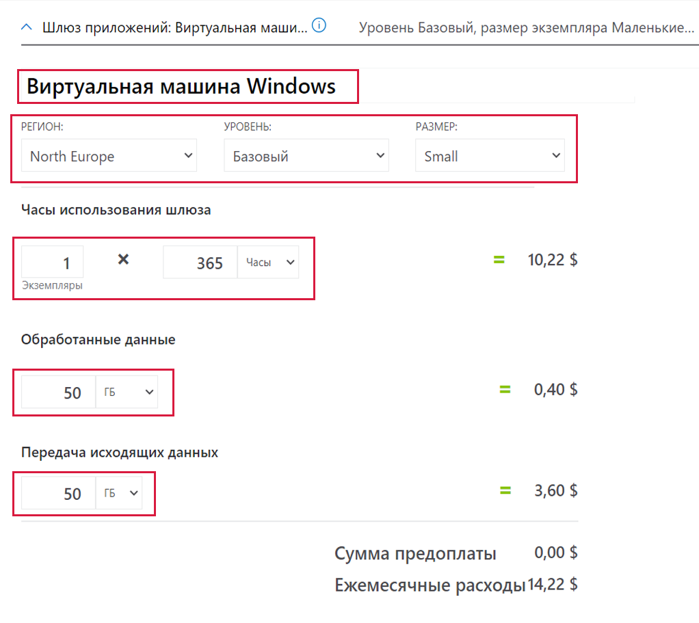
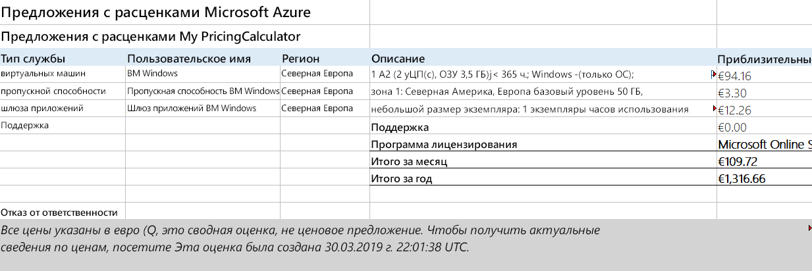

---
wts:
    title: '19 — использование калькулятора цен Azure (10 мин)'
    module: 'Модуль 06. Описание соглашений об управлении затратами и уровне обслуживания Azure'
---
# 19 — Использование калькулятора цен Azure (10 мин)

В этом пошаговом руководстве мы воспользуемся калькулятором цен Azure, чтобы оценить стоимость виртуальной машины Azure и связанных сетевых ресурсов.

# Задача 1. Настройка калькулятора цен

В рамках этой задачи мы оценим стоимость примера инфраструктуры с помощью калькулятора цен Azure. 

**Примечание**. Чтобы выполнить оценку с помощью калькулятора цен Azure, в этом пошаговом руководстве приведены примеры конфигураций для виртуальной машины и связанных ресурсов. Используйте эти примеры конфигураций или укажите в калькуляторе цен Azure подробную информацию о ваших *фактических* требованиях к ресурсам.

1. В браузере перейдите на веб-страницу [калькулятора цен Azure](https://azure.microsoft.com/ru-ru/pricing/calculator/).

2. Чтобы добавить сведения о конфигурации виртуальной машины, щелкните **Virtual Machines** (Виртуальные машины) на вкладке **Products** (Продукты). Прокрутите вниз, чтобы просмотреть сведения о виртуальной машине. 

3. Замените текст **Your Estimate** (Расчетная стоимость для вас) и **Virtual Machines** (Виртуальные машины) более описательными названиями для оценки с помощью калькулятора цен Azure и конфигурации виртуальной машины. В этом пошаговом примере для оценки используется название **My Pricing Calculator Estimate** (Моя оценка калькулятора цен), а для конфигурации виртуальной машины — название **Windows VM** (Виртуальная машина Windows).

   

4. Измените конфигурацию виртуальной машины по умолчанию.

    | Параметры | Значение |
    | -- | -- |
    | Регион | **Северная Европа** |
    | Операционная система | **Windows** |
    | Тип | **(Только ОС)** |
    | Уровень | **Стандартный** |  
    | Экземпляр | **A2: 2 ядра, 3,5 ГБ ОЗУ, временное хранилище на 135 ГБ** |

   

    **Примечание**. Цены и спецификации экземпляра виртуальной машины могут отличаться от приведенных в этом примере. Следуйте этому пошаговому руководству, выбрав экземпляр, который максимально соответствует данному примеру. Чтобы просмотреть подробную информацию о различных параметрах продукта виртуальной машины, выберите **Product details** (Сведения о продукте) в меню **More info** (Подробнее) справа.

5. Установите для параметра **Billing Option** (Вариант оплаты) значение **Pay as you go** (Оплата по мере использования).

   

6. В Azure месяц определяется равным 730 часам. Если ваша виртуальная машина должна быть доступна 100 процентов времени каждый месяц, установите количество часов в месяц равным `730`. В этом примере требуется, чтобы одна виртуальная машина была доступна 50 процентов времени каждый месяц.

    Оставьте количество виртуальных машин равным `1` и измените количество часов в месяц на `365`.

   

7. На панели **Managed OS Disks** (Управляемые диски ОС) измените конфигурацию хранилища виртуальной машины по умолчанию.

    | Уровень | Размер диска | Число дисков | Моментальный снимок | Транзакции хранилища |
    | ---- | --------- | --------------- | -------- | -------------------- |
    | HDD (цен. категория "Стандартный") | S30: 1024 ГиБ | 1 | Отключено | 10 000 |

   

8. Чтобы добавить пропускную способность сети к своей оценке, перейдите в верхнюю часть веб-страницы калькулятора цен Azure. Щелкните **Networking** (Работа в сети) в меню продукта слева, а затем щелкните плитку **Bandwidth** (Пропускная способность). В диалоговом окне сообщения **Bandwidth added** (Добавлено: Bandwidth) щелкните **View** (Просмотр).

   

9. Добавьте имя для конфигурации пропускной способности вашей виртуальной машины. В этом примере используется имя **Bandwidth: Windows VM** (Пропускная способность: виртуальная машина Windows). Измените конфигурацию пропускной способности по умолчанию, добавив следующие сведения.

    | Регион | Величина "Передача исходящих данных" для зоны 1 |
    | ------ | -------------------------------------- |
    | Северная Европа | 50 ГБ |

   

10. Чтобы добавить шлюз приложений, вернитесь в верхнюю часть веб-страницы калькулятора цен Azure. В меню продукта **Networking** (Работа в сети) щелкните плитку **Application Gateway** (Шлюз приложений). В диалоговом окне сообщения **Application Gateway** (Шлюз приложений) щелкните **View** (Просмотр).

    

11. Добавьте имя для конфигурации шлюза приложений. В этом примере используется имя **App Gateway: Windows VM** (Пропускная способность: виртуальная машина Windows). Измените конфигурацию шлюза приложений по умолчанию, добавив следующие сведения.

    | Параметры | Значение |
    | -- | -- |
    | Регион | **Северная Европа** |
    | Уровень | **Базовый** |
    | Размер | **Маленький** |
    | Экземпляры | **1** |  
    | Часы | **365** |
    | Обработанные данные | **50 ГБ** |
    | Зона 1: Северная Америка, Европа | **50 ГБ**|

    

# Задача 2. Ознакомление с оценкой цен

В рамках этой задачи мы рассмотрим результаты калькулятора цен Azure. 

1. Прокрутите страницу калькулятора цен Azure вниз до конца, чтобы просмотреть итоговое значение **Estimated monthly cost** (Расчетная месячная стоимость).

    **Примечание**. Изучите различные параметры, доступные в калькуляторе цен Azure. Например, в этом пошаговом руководстве вам требуется изменить валюту на евро.

2. Измените валюту на евро, а затем выберите **Export** (Экспортировать), чтобы скачать копию оценки в формате Microsoft Excel (`XLSX`) для просмотра в автономном режиме.

    

    

Поздравляем! Вы скачали оценку из калькулятора цен Azure.
